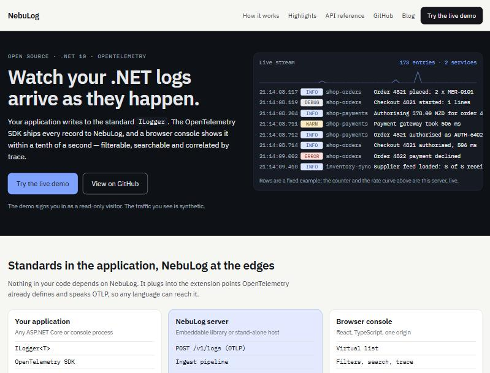
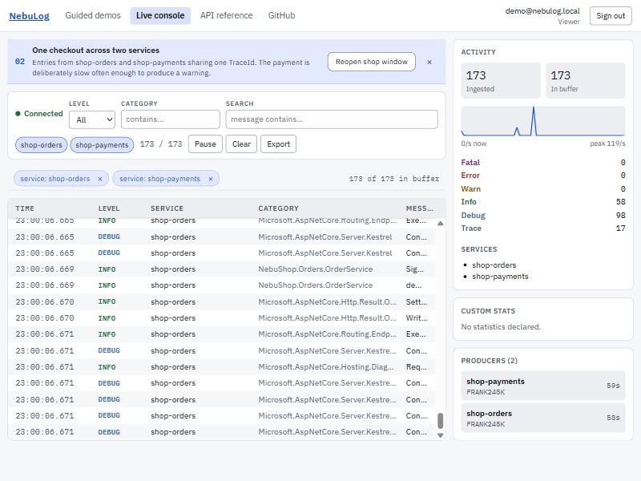
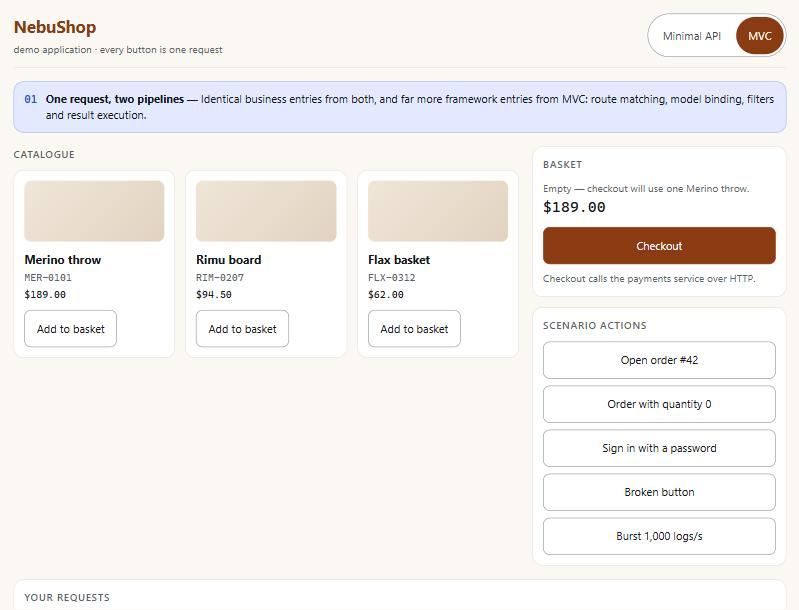
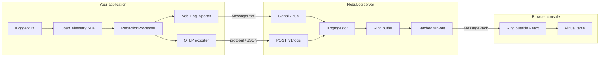

# NebuLog

Real-time log streaming for .NET, built on OpenTelemetry: your application writes to the standard
`ILogger`, and a browser console shows every record within a tenth of a second — filterable,
searchable, and correlated by trace across services.

**Live demo: <https://nebulog.imady.co.nz>** — press *Continue as demo visitor*; no account needed.

[](https://github.com/imadyTech/NebuLog/actions/workflows/ci.yml)
[](LICENSE)



The live console, filtered to one scenario, showing two services under a single trace:



The guided demos open a small shop application beside the console. Every button there is exactly one
HTTP request, and its TraceId is shown so you can find it in the console:



---

## Contents

- [Quick start](#quick-start)
- [Sending logs from your application](#sending-logs-from-your-application)
- [Configuration](#configuration)
- [Deployment](#deployment)
- [How it fits together](#how-it-fits-together)
- [Security](#security)
- [Repository layout](#repository-layout)
- [History](#history)
- [Changelog and licence](#changelog-and-licence)

---

## Quick start

### With Docker Compose

The fastest way to see everything, including the demo producer and the guided-demo shop:

```bash
git clone https://github.com/imadyTech/NebuLog.git
cd NebuLog/deploy
cp .env.example .env     # then fill in NEBULOG_TAG, the admin account and the API keys
docker compose up -d
```

Then open <http://localhost:2000>.

### From source

Needs the .NET 10 SDK and Node 22+.

```bash
git clone https://github.com/imadyTech/NebuLog.git
cd NebuLog

# The dashboard build must run first: it empties wwwroot, and the browser sample publishes into it.
npm --prefix web/dashboard ci && npm --prefix web/dashboard run build
npm --prefix samples/browser install && npm --prefix samples/browser run build

dotnet run --project src/NebuLog.Server.Host
```

Then open <http://localhost:5080>. Set an administrator before the first run, or no account exists:

```bash
dotnet user-secrets --project src/NebuLog.Server.Host set "NebuLog:Admin:Email" "you@example.com"
dotnet user-secrets --project src/NebuLog.Server.Host set "NebuLog:Admin:Password" "a-password-of-12+"
```

Sign in, open **API keys**, create one, and point a producer at it.

To run the guided-demo shop as well, build `web/shop` and start both shop services, then set
`NebuLog:Shop:OrdersUrl`; see [`samples/NebuShop.Orders`](samples/NebuShop.Orders/).

---

## Sending logs from your application

There are two ways in, and they converge on the same ingest pipeline inside the server.

### 1. The NebuLog exporter (SignalR)

Lowest latency, and the only transport that can also carry live statistics and inbound commands.

```csharp
builder.Services.AddOpenTelemetry()
    .ConfigureResource(r => r.AddService("OrderApi"))
    .WithLogging(logging => logging
        .AddNebuLogRedaction()                       // mask sensitive attributes, before export
        .AddNebuLogExporter(o =>
        {
            o.Endpoint = new Uri("https://logs.example.com");
            o.ApiKey = builder.Configuration["NebuLog:ApiKey"]!;
        }));

builder.Services.AddNebuLogClient();                  // INebuLogStats and INebuLogCommands
```

### 2. The stock OTLP exporter (any language, any SDK)

Keep your existing OpenTelemetry setup and point it at NebuLog. Nothing in your code then depends on
NebuLog at all.

```csharp
logging.AddOtlpExporter(o =>
{
    o.Protocol = OtlpExportProtocol.HttpProtobuf;
    o.Endpoint = new Uri("https://logs.example.com/v1/logs");
    o.Headers = "X-Api-Key=nbl_...";
});
```

`POST /v1/logs` accepts OTLP protobuf and OTLP/JSON, gzip-encoded or plain. There is a browser
example in [`samples/browser`](samples/browser/) that uses nothing but `fetch`.

Working examples of both are in [`samples/`](samples/).

---

## Configuration

All keys bind from configuration; in containers use the `__` form, for example
`NebuLog__Server__BufferCapacity`.

### Server (`NebuLog:Server`)

| Key | Default | What it does |
|---|---|---|
| `BufferCapacity` | `50000` | Entries kept in the in-memory ring buffer |
| `IngestQueueCapacity` | `100000` | Bounded channel between receivers and the pipeline; overflow is counted, not blocked |
| `BroadcastInterval` | `00:00:00.100` | How often batches are pushed to the browser |
| `MaxBroadcastBatch` | `1000` | Largest batch sent in one push |
| `MaxAttributesPerEntry` | `64` | Attributes kept per entry; the rest are dropped |
| `MaxAttributeValueLength` | `8192` | Attribute values are truncated to this |
| `MaxHubMessageBytes` | `4194304` | SignalR receive limit; the 32 KiB default closes connections on large batches |

### Security, storage and networking

| Key | Default | What it does |
|---|---|---|
| `ConnectionStrings:Identity` | `App_Data` file | SQLite connection string for accounts and API keys |
| `NebuLog:Admin:Email` / `:Password` | — | Seeded once, only if the account does not exist |
| `NebuLog:DataProtection:KeysPath` | framework default | Must be writable; required when the root filesystem is read-only |
| `NebuLog:Demo:Enabled` | `true` | Enables the read-only demo visitor account |
| `NebuLog:ForwardedHeaders:KnownNetworks` | empty | CIDR blocks whose `CF-Connecting-IP` is trusted; empty disables the feature |
| `NebuLog:Cors:AllowedOrigins` | empty | Origins allowed to `POST /v1/logs` from a browser |
| `NebuLog:RateLimit:*` | see below | Ingest token bucket and API fixed window |
| `NebuLog:Otlp:MaxRequestBodyBytes` | `4194304` | Decompressed ceiling for `/v1/logs` |
| `NebuLog:Shop:OrdersUrl` | empty | Reverse-proxies the demo shop at `/apps/shop`; empty removes the route entirely |
| `NebuLog:Site:BlogUrl` / `:GitHubUrl` | empty / this repo | Links shown on the public pages |

Rate limiting defaults: ingest 50 tokens/second with a bucket of 200, per client; the dashboard API
100 requests per 10 seconds.

### Exporter (`NebuLog:*` in the producing application)

| Key | Default | What it does |
|---|---|---|
| `Endpoint` | — | Base address of the NebuLog server |
| `ApiKey` | — | A Producer key, `nbl_<prefix>_<secret>` |
| `BatchSize` / `BatchInterval` | `500` / `1s` | Export batching |
| `QueueCapacity` | `10000` | Bounded; overflow is counted and reported, never blocks the caller |

---

## Deployment

Images are published to GHCR on every push to `master` and on `v*` tags, with **immutable tags
only** — `sha-<short commit>`, plus the bare version on a tag. Never `latest`; upgrading and rolling
back are both a one-line change to `NEBULOG_TAG`.

| Image | What it is |
|---|---|
| `ghcr.io/imadytech/nebulog` | The server and the dashboard |
| `ghcr.io/imadytech/nebulog-demo-producer` | Synthetic traffic for the public demo |
| `ghcr.io/imadytech/nebulog-shop-orders` | The guided-demo shop (two API implementations) |
| `ghcr.io/imadytech/nebulog-shop-payments` | The downstream service the shop calls |

The containers run as a non-root user with a **read-only root filesystem**. The server has one
writable volume at `/data` for the SQLite database and the Data Protection key ring; the others have
no volume at all. Health is checked by the application itself (`--health-check`), because the ASP.NET
runtime image carries neither curl nor wget.

Behind a reverse proxy, set `NebuLog:ForwardedHeaders:KnownNetworks` to the proxy's network so the
real client address is used for rate limiting; leave it empty and the header is ignored rather than
trusted. A full worked example, including Cloudflare Tunnel, is in [`deploy/`](deploy/).

---

## How it fits together



Both receivers normalise onto one `ILogIngestor`, so an entry behaves identically whichever way it
arrived. The browser keeps its own ring of plain objects outside React state and commits batches once
per animation frame, which is what keeps a hundred thousand entries scrolling smoothly.

Measured on 2026-10-05 (methods and sources in the evaluation section of the development log):

| | |
|---|---|
| Sustained ingest | 10,077 entries/second for five seconds, zero rejections |
| Producer-to-browser latency | p50 109 ms, p95 115 ms on an idle server |
| DOM rows at 100,000 buffered | about 51 |
| Dashboard JavaScript | 122 KB gzipped |
| Tests | 324 (246 .NET, 78 frontend) |

---

## Security

- **Two kinds of identity.** People sign in with a cookie session; programs present an `X-Api-Key`
  header. A policy scheme picks per request, so one endpoint serves both.
- **Four roles.** Viewer reads, Operator sends commands to producers, Admin manages API keys, and
  Producer may only publish. There is no registration endpoint: accounts are seeded from
  configuration, and API keys are issued by an administrator and stored only as hashes.
- **Log bodies are rendered as text, never as HTML.** Two checks enforce it in CI — oxlint's
  `react/no-danger` and a script covering the `innerHTML` family — and both were verified against a
  deliberate violation rather than assumed to work.
- **Redaction masks attribute values, and that is all it can do.** `RedactionProcessor` replaces the
  value of any attribute whose key looks sensitive (`password`, `token`, `secret`, …) with `***`
  before the record leaves your process. It cannot help with a secret you formatted into the message
  text, because by then it is indistinguishable from the rest of the sentence. The rule that follows
  is not "redaction will catch it" but **do not log secrets**; redaction is a backstop for the case
  you missed. Scenario 05 of the guided demos shows both halves of this.

---

## Repository layout

| Path | What it is |
|---|---|
| `src/NebuLog.Contracts` | Wire contracts (netstandard2.1 / net10.0) |
| `src/NebuLog.OpenTelemetry` | SDK extensions: exporter, redaction processor, stats, commands |
| `src/NebuLog.Server` | The embeddable server: `AddNebuLogServer()` + `MapNebuLog()` |
| `src/NebuLog.Server.Host` | Stand-alone host; serves the dashboard from `wwwroot` |
| `web/dashboard` | The React console and the public site pages |
| `web/shop` | The NebuShop demo application |
| `web/shared` | Design tokens, scenario definitions and the cross-window message contract |
| `samples/` | Minimal API, demo producer, NebuShop services, browser OTLP sample |
| `tests/` | Unit and integration tests, including the protocol and performance checks |
| `deploy/` | Compose file and deployment notes |

### Build and test

```bash
dotnet build NebuLog.slnx -c Release
dotnet test NebuLog.slnx -c Release
npm --prefix web/dashboard run lint && npm --prefix web/dashboard test
npm --prefix web/shop run lint && npm --prefix web/shop test
```

Tests run on Microsoft.Testing.Platform, selected in `global.json`; .NET 10 no longer supports
VSTest. The build treats warnings as errors.

---

## History

NebuLog started in December 2018 as *MyLogger*, a WinForms viewer for a logging experiment, and was
renamed in August 2019. It was developed through October 2022 and is archived at the
[`v1-final`](https://github.com/imadyTech/NebuLog/tree/v1-final) tag (also on the
[`v1`](https://github.com/imadyTech/NebuLog/tree/v1) branch). In 2020 the repository was included in
the GitHub Arctic Code Vault.

The author documented v1 as it was built, in a seven-part series (in Chinese) on Zhihu:

| | |
|---|---|
| 0 | [Origins and development](https://zhuanlan.zhihu.com/p/258847899) |
| 1 | [Project structure](https://zhuanlan.zhihu.com/p/258974363) |
| 2 | [Collecting and shaping logs in an MVC application](https://zhuanlan.zhihu.com/p/258974461) |
| 3 | [Forwarding Unity's `Debug.Log` to another machine](https://zhuanlan.zhihu.com/p/258974737) |
| 4 | [Sending logs from a WPF client](https://zhuanlan.zhihu.com/p/260091996) |
| 5 | [Hosting the SignalR hub inside WPF](https://zhuanlan.zhihu.com/p/260489557) |
| 6 | [A Blazor WebAssembly server](https://zhuanlan.zhihu.com/p/261311503) |

v2 is a rewrite rather than an upgrade. v1 worked, but the hub was open to anyone, log bodies were
inserted into the page as HTML, the table was rebuilt on every entry, it no longer built from a clean
clone, and its dependencies carried 57 security advisories. v2 targets .NET 10, is built around the
official OpenTelemetry SDK, authenticates from the start, and has 324 automated tests where v1 had
none.

---

## Changelog and licence

See [CHANGELOG.md](CHANGELOG.md) for what changed in each release.

Licensed under the [Apache License 2.0](LICENSE). Copyright © Imady NZ Limited.
