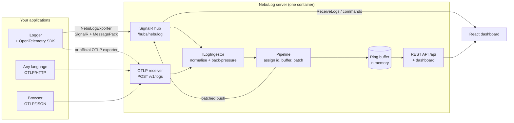

# NebuLog

A real-time log dashboard for .NET, built on OpenTelemetry. Applications log through the standard
`ILogger`; NebuLog collects, buffers and streams those entries to a browser with sub-second latency,
and lets an operator push commands back to the running application.

Live demo: **<https://nebulog.imady.co.nz>** — "Continue as demo visitor" needs no account.

This is version 2, a ground-up rewrite. [What changed, and why](#v1--v2) is at the bottom.

---

## How it fits together



Both ingestion paths converge on one `ILogIngestor`, so normalisation, sequencing and back-pressure
are decided in exactly one place. The SignalR path is additionally bidirectional: it carries live
statistics up and operator commands down, which plain OTLP cannot do.

## Quick start

Needs the .NET 10 SDK and Node 22+.

```bash
git clone https://github.com/imadyTech/NebuLog.git
cd NebuLog

# The dashboard build must run first: it empties wwwroot, and the browser sample publishes into it.
npm --prefix web/dashboard ci && npm --prefix web/dashboard run build
npm --prefix samples/browser install && npm --prefix samples/browser run build

dotnet run --project src/NebuLog.Server.Host
```

Then open <http://localhost:5080>. Set an administrator before the first run, or no account exists:

```bash
dotnet user-secrets --project src/NebuLog.Server.Host set "NebuLog:Admin:Email" "you@example.com"
dotnet user-secrets --project src/NebuLog.Server.Host set "NebuLog:Admin:Password" "a-password-of-12+"
```

Sign in, open **API keys**, create one, and point a producer at it.

### Sending logs from your application

```csharp
builder.Services.AddOpenTelemetry()
    .ConfigureResource(r => r.AddService("OrderApi"))
    .WithLogging(logging => logging
        .AddNebuLogRedaction()                       // mask sensitive attributes, before export
        .AddNebuLogExporter(o =>
        {
            o.Endpoint = new Uri("https://logs.example.com");
            o.ApiKey = builder.Configuration["NebuLog:ApiKey"]!;
        }));

builder.Services.AddNebuLogClient();                  // INebuLogStats and INebuLogCommands
```

Or keep your existing OpenTelemetry setup and just point it at NebuLog — any language, any SDK:

```csharp
logging.AddOtlpExporter(o =>
{
    o.Protocol = OtlpExportProtocol.HttpProtobuf;
    o.Endpoint = new Uri("https://logs.example.com/v1/logs");
    o.Headers = "X-Api-Key=nbl_...";
});
```

Working examples of both are in [`samples/`](samples/).

## Repository layout

| Path | What it is |
|---|---|
| `src/NebuLog.Contracts` | Wire contracts (netstandard2.1 / net10.0) |
| `src/NebuLog.OpenTelemetry` | SDK extensions: exporter, redaction processor, stats, commands |
| `src/NebuLog.Server` | The embeddable server: `AddNebuLogServer()` + `MapNebuLog()` |
| `src/NebuLog.Server.Host` | Stand-alone host; serves the dashboard same-origin |
| `web/dashboard` | React dashboard |
| `samples/` | Minimal API, demo producer, browser OTLP page |
| `deploy/` | compose file and deployment notes |
| `docs/` | Plan, ADRs, work orders, the build journal |

## What it does

- **Two ingestion paths, one model.** `NebuLogExporter` over SignalR with MessagePack, and
  OTLP/HTTP at `POST /v1/logs` accepting protobuf *and* OTLP/JSON, gzip optional.
- **Interoperability is tested, not claimed.** A test boots a stock
  `OpenTelemetry.Exporter.OpenTelemetryProtocol`, configured with nothing but a URL, and asserts the
  entry arrives at a dashboard.
- **Back-pressure that is visible.** A full ingest queue answers 503 with `Retry-After`, which OTLP
  treats as retryable, rather than silently dropping.
- **Two kinds of caller.** People sign in and get a session cookie; programs send `X-Api-Key`. One
  policy scheme picks per request. Roles: `Viewer`, `Operator`, `Admin`, and `Producer` for keys.
- **Commands back down the same socket.** An operator can `ping` a producer or change its minimum
  log level at run time, without a deployment.
- **A dashboard that does not fall over.** 100,000 entries buffered with 1,000/s arriving: ~51 rows
  in the DOM, median 4.8 ms per scroll step. See
  [`web/dashboard/scripts/perf.md`](web/dashboard/scripts/perf.md).

### A note on redaction

`AddNebuLogRedaction()` masks attribute values whose key looks sensitive — `password`, `token`,
`authorization` and friends — before the entry leaves your process. It is a backstop, not a licence.

It cannot mask the rendered message, because the logging pipeline formats that text before any
processor sees the record. And `[LoggerMessage]` will not let you pass a parameter that is absent
from the template (SYSLIB1015), so with source-generated logging a redacted attribute necessarily
appears in the prose as well. `samples/NebuLog.Samples.MinimalApi` shows exactly this: the
`Password` attribute arrives as `***`, while the message body still carries the value.

The rule that follows is the boring one: **do not log secrets.** Redaction is there for the case you
missed, not for the ones you chose.

## Identity and API keys

Two kinds of caller are distinguished. **People** sign in with email and password and get a session
cookie; **programs** send an API key in `X-Api-Key`. A single policy scheme picks between them per
request, so both share one pipeline.

There is no registration endpoint: accounts are seeded from configuration, and keys are issued by an
administrator.

| Setting | Purpose |
|---|---|
| `ConnectionStrings__Identity` | SQLite database. Production: `Data Source=/data/nebulog.db` |
| `NebuLog__Admin__Email` / `NebuLog__Admin__Password` | Seeded once if the account is absent |
| `NebuLog__Demo__Enabled` | Offers a read-only `demo@nebulog.local` sign-in (default `true`) |
| `NebuLog__DemoProducer__ApiKey` | Seeds a producer key; only its hash is stored |
| `NebuLog__DataProtection__KeysPath` | Key ring directory. Production: `/data/keys` |

Only hashes are stored: an API key's clear text is shown once, at creation, and is not recoverable.

### Trade-off: migrating at startup

The application applies EF Core migrations and seeds its roles and accounts while starting, from a
hosted service. That is deliberate for this deployment — one container, one SQLite file — where a
separate migration step would add operational work for no benefit. It would be the wrong choice for
a multi-instance deployment, where two instances could race to migrate the same database; that would
call for a separate migration job and a startup that only verifies the schema.

All seeding is idempotent and never modifies an existing account, so restarting the container cannot
reset a password that was changed afterwards.

### Writable paths

The container runs with a read-only root filesystem and one writable volume at `/data`. Everything
written at runtime — the SQLite database and the Data Protection key ring — is placed under the
configured paths, which is covered by `WritablePathsTests`.

## Build and test

```bash
npm --prefix web/dashboard ci
npm --prefix web/dashboard run lint     # also checks for raw HTML injection and WCAG contrast
npm --prefix web/dashboard test
npm --prefix web/dashboard run build

dotnet build NebuLog.slnx               # 0 warnings; warnings are errors
dotnet test NebuLog.slnx
```

## Deployment

See [`deploy/README.md`](deploy/README.md). Images are published to GHCR by
[`.github/workflows/release.yml`](.github/workflows/release.yml) with immutable tags —
`sha-<short commit>`, plus the bare version on a `v*` tag. Never `latest`, so a roll-back is a
one-line change to a tag.

## v1 → v2

v1 was a .NET 6 project that worked but had accumulated the usual problems: the hub was open to
anyone, log bodies were inserted into the page as HTML (so any producer could script the dashboard),
the table rebuilt itself on every entry and stalled past ten thousand rows, and the build no longer
ran from a clean clone.

v2 keeps the idea and rewrites the implementation: OpenTelemetry instead of a bespoke client
protocol, authentication from the start, a virtualised dashboard, and automated tests as the
definition of done. The full before-and-after — including what the rewrite cost and where the AI
doing it got things wrong — is in [`docs/journey/journey-log.md`](docs/journey/journey-log.md).

## Licence

Apache-2.0
